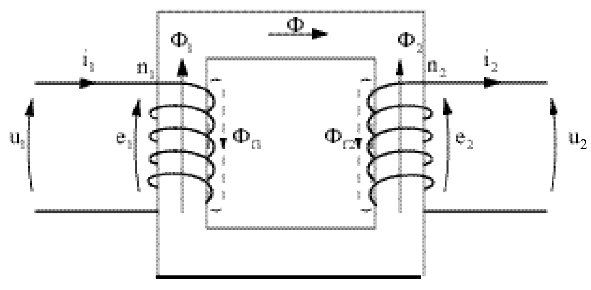

# Introduction

A simple way to write slides !

# Structure

## Title Slide

```md
---
title: [title]
subtitle: [subtitle]
author: [author]
date: [date]
---
```

## Separating Slides

- New title
    - Level 1 : horizontal slide
    - Level 2 : vertical slide
- `---`

# Possible Contents

## Text

Paragraphs :

Lorem ipsum dolor sit amet, consectetur adipiscing elit. Sed at augue vestibulum, vestibulum eros ut, ullamcorper dolor. Suspendisse semper tortor non faucibus gravida. In sed volutpat nibh. Cras porttitor tellus at est imperdiet consequat tempor eget nunc.

Nulla maximus, augue vel pharetra feugiat, elit magna consequat sapien, vitae bibendum purus sem sed urna. Cras tincidunt id neque vitae pretium. Nam eu nisi tincidunt, tincidunt orci ut, consectetur lorem. Donec dapibus nulla lectus, interdum efficitur orci efficitur a. Mauris auctor mattis purus eu elementum.

---

- Unordered lists
- (already shown ;)

1. Ordered lists
2. Follow the order !

## Math

Slides can render inline math, such as $f(x) = \frac{\sin(x)}{x}$, and math blocks, like
$$
\int_{-\infty}^{\infty} f(x) = \pi.
$$

## Images

Images are always located in the `./images` directory.
Right now I only have one :


# Viewing Slides

1. Run `./build.sh` from `~/my-slides`
2. Html slides are available in the `./slides` directory
3. Open them with a web browser

# Conclusion

Have fun !
